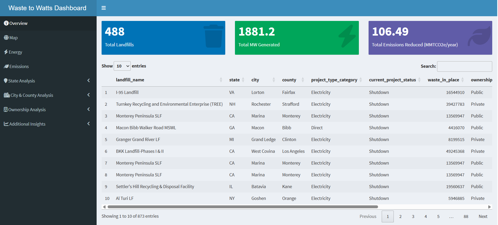
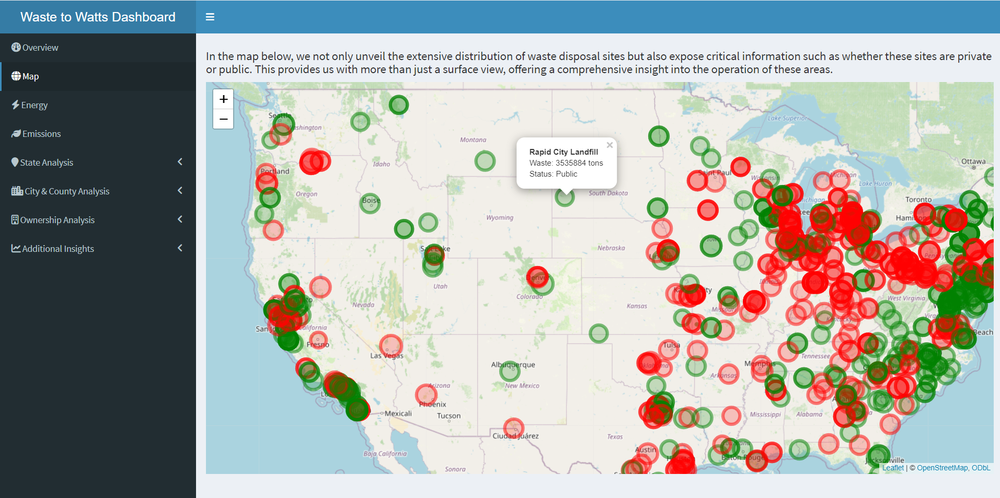
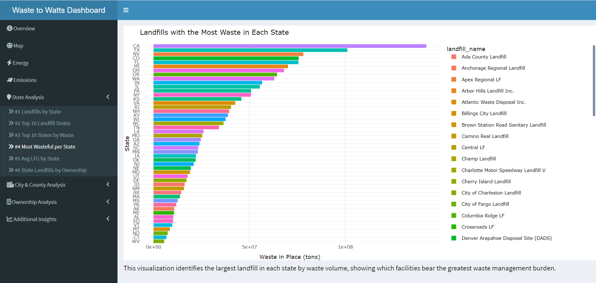
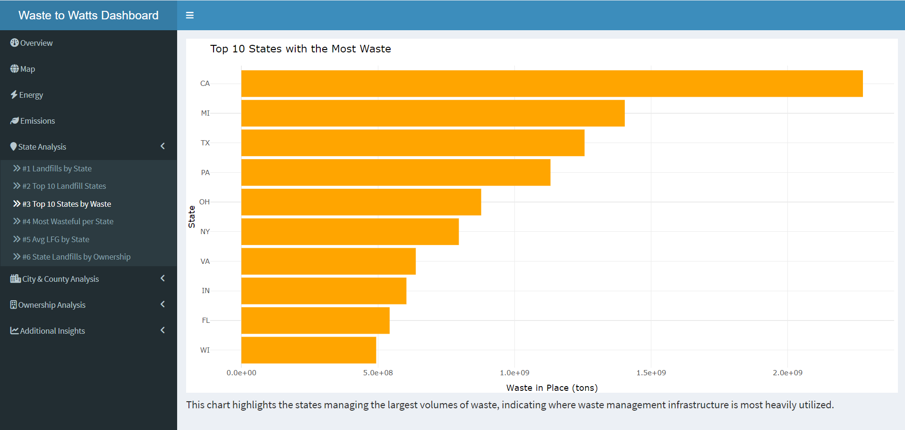
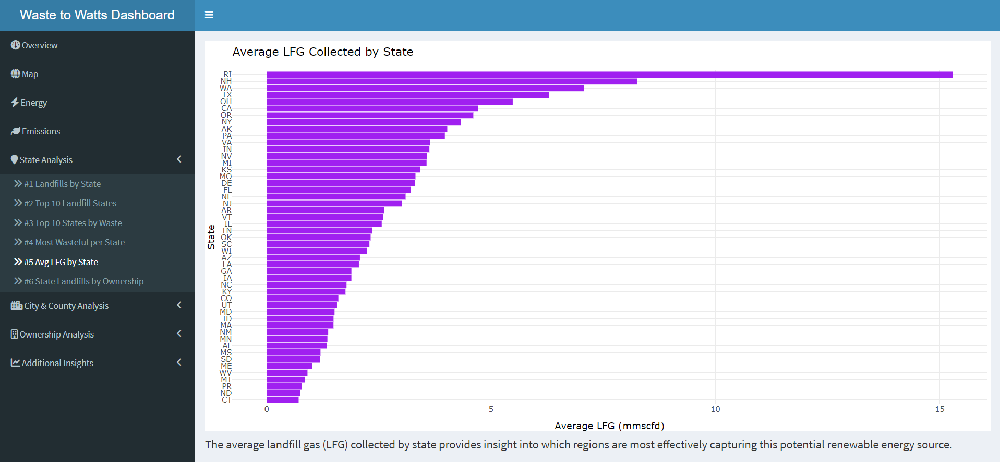
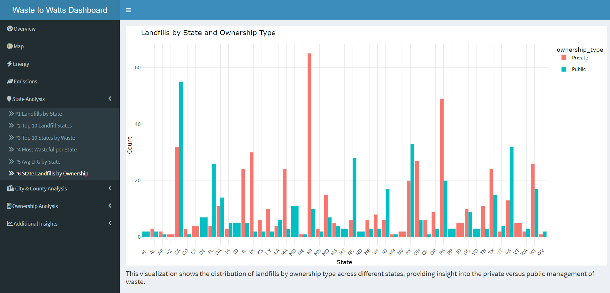
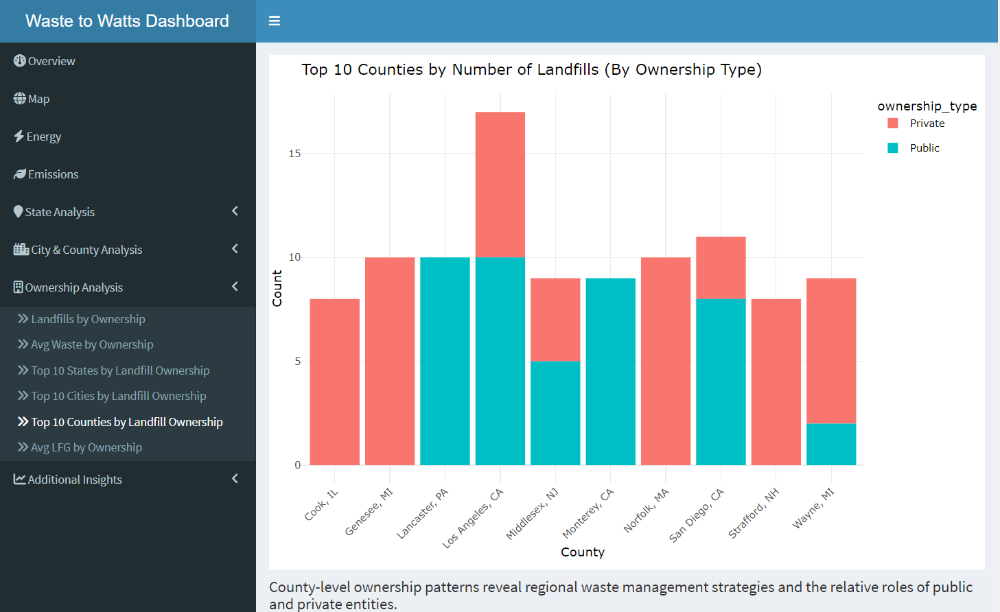
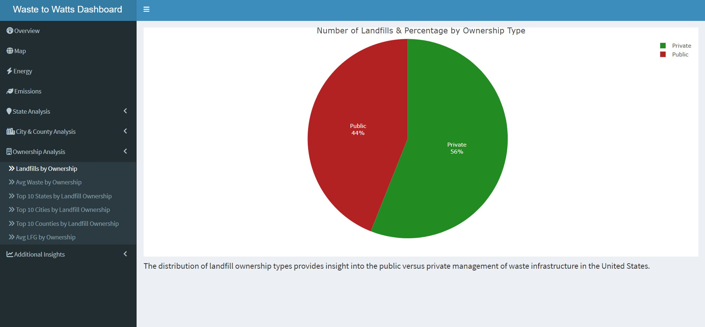
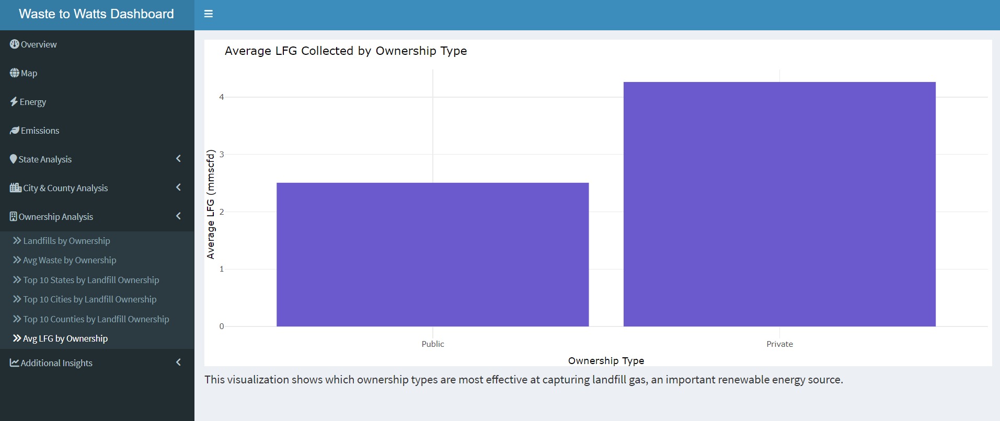

# 📊 Waste to Watts: Renewable Energy & Emissions from U.S. Landfills

## 💡 Project Overview

This project is an interactive **R Shiny dashboard** designed to explore landfill data across the United States. The application analyzes patterns in waste disposal, renewable energy production, and landfill gas (LFG) emissions reduction. The project not only provides a detailed data exploration experience but also serves as a showcase of R programming skills in data cleaning, transformation, and interactive visualization.

## 🚀 Purpose

The goal of this project is to demonstrate proficiency in R and to build an intuitive, visually-rich, and informative dashboard using:

- **R Shiny** for building the web application
- **Tidyverse** for data wrangling and manipulation
- **Plotly** and **Leaflet** for interactive visualizations

This project also reflects experience in real-world environmental datasets and insights related to sustainability, urban infrastructure, and energy.

## 📊 Key Features

### 🔍 Overview

- Total landfills, MW generated, and CO2e emissions reduced
- Interactive data table with filtering
  

### 🌍 Map View

- Interactive Leaflet map showing landfill locations
- Circle size represents waste in place
- Circle color based on ownership (Public, Private, Other)
  

### ⚡ Energy and Emissions

- Bar and line plots comparing LFG collected and MW generated
- Emissions reduced over time (Direct & Avoided CO2e)

### 🌐 State Analysis

- Landfills by state
- Largest landfill in each state
  
- Top 10 states by landfills and waste
  
- LFG collection averages
  
- State-wise ownership type breakdowns
  

### 🌆 City & County Analysis

- Top 10 cities and counties by number of landfills
- Top 10 cities and counties by waste volume
  

### 🏢 Ownership Analysis

- Pie chart: public vs. private landfill share
  
- Avg. waste by ownership
- Ownership breakdowns across top states, cities, and counties
- Avg. LFG collected by ownership type
  
### 🔬 Additional Insights

- Top 10 landfills with the most active days (duration between project start and finish)

## 🎓 Skills Demonstrated

- Data wrangling with `dplyr`, `janitor`, `lubridate`
- Advanced plotting using `ggplot2` + `plotly`
- Spatial data visualization using `leaflet`
- Modular UI design with grouped menu items
- Custom CSS tweaks (e.g., sidebar width increased)

## 📂 File Structure

- `app.R` - Full source code for R Shiny dashboard
- `landfill_data.csv` - Cleaned dataset used in the app (not included here)

## 🔹 Dataset

- **Source**: The data used in this project originates from a Kaggle notebook:
  [Analysis of Landfills in America by Mehmet Isik](https://www.kaggle.com/code/mehmetisik/analysis-of-landfills-in-america/notebook)
- **Note**: While the original code was written in Python, this dashboard was built from scratch in **R**.
- **Corrections Made**: The original code contained mislabeled legends and minor inconsistencies, which have been corrected in this R-based implementation.

## 🚜 How to Run Locally

```r
# Install required packages if not already installed:
install.packages(c("shiny", "shinydashboard", "tidyverse", "plotly", "leaflet", "DT", "lubridate", "janitor"))

# Run the app
shiny::runApp("app.R")
```

## 😎 About the Developer

I have experience in R across:

- Data analysis and visualization
- Preprocessing and feature engineering
- Statistical modeling and machine learning
- Projects involving both structured (numerical) and unstructured (NLP/text) datasets

This project was built to demonstrate those skills in a real-world, impactful domain.

---

Thank you for checking out the project!
For questions, collaboration, or feedback, feel free to reach out via GitHub or LinkedIn.
